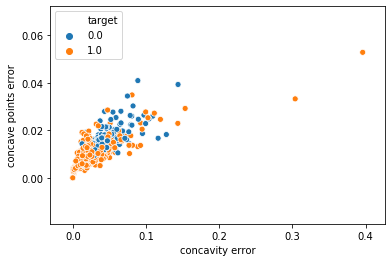
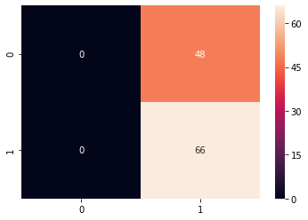

# Breast Cancer Classification

### ***A Fight Against Breast Cancer***


## Motivation/Problem Statement:--
Breast cancer is very big problem in women, data shoes that 2.1 Million of women having breast cancer in 2015.
With 79% of accuracy type breast cancer is detected by physicians & in Machine Learning this figures ranges around 90% 
(91-  97)%.
There are 2 types of tumers in breast cancer which are.. 1.Malignant(Spreads at faster rate in body  2.Benign(does not spreads faster in body).
The Benign Means to the Non-Presence of cancer in the patient.
We will use SVM-classifier to classify the type of cancer.
We use different features of tumer such as RADIUS,TEXTURE,PERIMETER,AREA,SMOOTHNESS

### LIBRARIES


```python
import pandas as pd
import numpy as np
import matplotlib.pyplot as plt
import seaborn as sns
%matplotlib inline
from sklearn.datasets import load_breast_cancer
```

### DATA


```python
data = load_breast_cancer()
data.keys()
```


    dict_keys(['data', 'target', 'target_names', 'DESCR', 'feature_names', 'filename'])


```python
print(data['DESCR'])
```

    .. _breast_cancer_dataset:
    
    Breast cancer wisconsin (diagnostic) dataset
    --------------------------------------------
    
    **Data Set Characteristics:**
    
        :Number of Instances: 569
    
        :Number of Attributes: 30 numeric, predictive attributes and the class
    
        :Attribute Information:
            - radius (mean of distances from center to points on the perimeter)
            - texture (standard deviation of gray-scale values)
            - perimeter
            - area
            - smoothness (local variation in radius lengths)
            - compactness (perimeter^2 / area - 1.0)
            - concavity (severity of concave portions of the contour)
            - concave points (number of concave portions of the contour)
            - symmetry 
            - fractal dimension ("coastline approximation" - 1)
    
            The mean, standard error, and "worst" or largest (mean of the three
            largest values) of these features were computed for each image,
            resulting in 30 features.  For instance, field 3 is Mean Radius, field
            13 is Radius SE, field 23 is Worst Radius.
    
            - class:
                    - WDBC-Malignant
                    - WDBC-Benign
    
        :Summary Statistics:
    
        ===================================== ====== ======
                                               Min    Max
        ===================================== ====== ======
        radius (mean):                        6.981  28.11
        texture (mean):                       9.71   39.28
        perimeter (mean):                     43.79  188.5
        area (mean):                          143.5  2501.0
        smoothness (mean):                    0.053  0.163
        compactness (mean):                   0.019  0.345
        concavity (mean):                     0.0    0.427
        concave points (mean):                0.0    0.201
        symmetry (mean):                      0.106  0.304
        fractal dimension (mean):             0.05   0.097
        radius (standard error):              0.112  2.873
        texture (standard error):             0.36   4.885
        perimeter (standard error):           0.757  21.98
        area (standard error):                6.802  542.2
        smoothness (standard error):          0.002  0.031
        compactness (standard error):         0.002  0.135
        concavity (standard error):           0.0    0.396
        concave points (standard error):      0.0    0.053
        symmetry (standard error):            0.008  0.079
        fractal dimension (standard error):   0.001  0.03
        radius (worst):                       7.93   36.04
        texture (worst):                      12.02  49.54
        perimeter (worst):                    50.41  251.2
        area (worst):                         185.2  4254.0
        smoothness (worst):                   0.071  0.223
        compactness (worst):                  0.027  1.058
        concavity (worst):                    0.0    1.252
        concave points (worst):               0.0    0.291
        symmetry (worst):                     0.156  0.664
        fractal dimension (worst):            0.055  0.208
        ===================================== ====== ======
    
        :Missing Attribute Values: None
    
        :Class Distribution: 212 - Malignant, 357 - Benign
    
        :Creator:  Dr. William H. Wolberg, W. Nick Street, Olvi L. Mangasarian
    
        :Donor: Nick Street
    
        :Date: November, 1995
    
    This is a copy of UCI ML Breast Cancer Wisconsin (Diagnostic) datasets.
    https://goo.gl/U2Uwz2
    
    Features are computed from a digitized image of a fine needle
    aspirate (FNA) of a breast mass.  They describe
    characteristics of the cell nuclei present in the image.
    
    Separating plane described above was obtained using
    Multisurface Method-Tree (MSM-T) [K. P. Bennett, "Decision Tree
    Construction Via Linear Programming." Proceedings of the 4th
    Midwest Artificial Intelligence and Cognitive Science Society,
    pp. 97-101, 1992], a classification method which uses linear
    programming to construct a decision tree.  Relevant features
    were selected using an exhaustive search in the space of 1-4
    features and 1-3 separating planes.
    
    The actual linear program used to obtain the separating plane
    in the 3-dimensional space is that described in:
    [K. P. Bennett and O. L. Mangasarian: "Robust Linear
    Programming Discrimination of Two Linearly Inseparable Sets",
    Optimization Methods and Software 1, 1992, 23-34].
    
    This database is also available through the UW CS ftp server:
    
    ftp ftp.cs.wisc.edu
    cd math-prog/cpo-dataset/machine-learn/WDBC/
    
    .. topic:: References
    
       - W.N. Street, W.H. Wolberg and O.L. Mangasarian. Nuclear feature extraction 
         for breast tumor diagnosis. IS&T/SPIE 1993 International Symposium on 
         Electronic Imaging: Science and Technology, volume 1905, pages 861-870,
         San Jose, CA, 1993.
       - O.L. Mangasarian, W.N. Street and W.H. Wolberg. Breast cancer diagnosis and 
         prognosis via linear programming. Operations Research, 43(4), pages 570-577, 
         July-August 1995.
       - W.H. Wolberg, W.N. Street, and O.L. Mangasarian. Machine learning techniques
         to diagnose breast cancer from fine-needle aspirates. Cancer Letters 77 (1994) 
         163-171.
    


```python
df = pd.DataFrame(np.c_[data['data'],data['target']],columns=np.append(data['feature_names'],['target']))
```


```python
df.head(2)
```


<div>
<style scoped>
    .dataframe tbody tr th:only-of-type {
        vertical-align: middle;
    }

    .dataframe tbody tr th {
        vertical-align: top;
    }

    .dataframe thead th {
        text-align: right;
    }
</style>
<table border="1" class="dataframe">
  <thead>
    <tr style="text-align: right;">
      <th></th>
      <th>mean radius</th>
      <th>mean texture</th>
      <th>mean perimeter</th>
      <th>mean area</th>
      <th>mean smoothness</th>
      <th>mean compactness</th>
      <th>mean concavity</th>
      <th>mean concave points</th>
      <th>mean symmetry</th>
      <th>mean fractal dimension</th>
      <th>...</th>
      <th>worst texture</th>
      <th>worst perimeter</th>
      <th>worst area</th>
      <th>worst smoothness</th>
      <th>worst compactness</th>
      <th>worst concavity</th>
      <th>worst concave points</th>
      <th>worst symmetry</th>
      <th>worst fractal dimension</th>
      <th>target</th>
    </tr>
  </thead>
  <tbody>
    <tr>
      <th>0</th>
      <td>17.99</td>
      <td>10.38</td>
      <td>122.8</td>
      <td>1001.0</td>
      <td>0.11840</td>
      <td>0.27760</td>
      <td>0.3001</td>
      <td>0.14710</td>
      <td>0.2419</td>
      <td>0.07871</td>
      <td>...</td>
      <td>17.33</td>
      <td>184.6</td>
      <td>2019.0</td>
      <td>0.1622</td>
      <td>0.6656</td>
      <td>0.7119</td>
      <td>0.2654</td>
      <td>0.4601</td>
      <td>0.11890</td>
      <td>0.0</td>
    </tr>
    <tr>
      <th>1</th>
      <td>20.57</td>
      <td>17.77</td>
      <td>132.9</td>
      <td>1326.0</td>
      <td>0.08474</td>
      <td>0.07864</td>
      <td>0.0869</td>
      <td>0.07017</td>
      <td>0.1812</td>
      <td>0.05667</td>
      <td>...</td>
      <td>23.41</td>
      <td>158.8</td>
      <td>1956.0</td>
      <td>0.1238</td>
      <td>0.1866</td>
      <td>0.2416</td>
      <td>0.1860</td>
      <td>0.2750</td>
      <td>0.08902</td>
      <td>0.0</td>
    </tr>
  </tbody>
</table>
<p>2 rows × 31 columns</p>
</div>


### DATA VISUALIZATION

Here 0:Malignant , 1:Benign


```python
sns.pairplot(df,vars=['mean radius','mean texture','mean perimeter','mean area','mean smoothness'],hue='target')
plt.show()
```


```python
sns.pairplot(df,vars=['mean compactness', 'mean concavity','mean concave points', 'mean symmetry', 'mean fractal dimension'],hue='target')
plt.show()
```


```python
sns.pairplot(df,vars=['radius error', 'texture error', 'perimeter error', 'area error','smoothness error'],hue='target')
plt.show()
```


```python
sns.pairplot(df,vars=['compactness error', 'concavity error', 'concave points error', 'symmetry error', 'fractal dimension error'],hue='target')
plt.show()
```


```python
sns.pairplot(df,vars=['worst radius', 'worst texture', 'worst perimeter', 'worst area','worst smoothness'],hue='target')
plt.show()
```


```python
sns.pairplot(df,vars=['worst compactness', 'worst concavity','worst concave points', 'worst symmetry', 'worst fractal dimension'],hue='target')
plt.show()
```


```python
sns.countplot(df['target'])
plt.show()
```


```python
df.columns
```


    Index(['mean radius', 'mean texture', 'mean perimeter', 'mean area',
           'mean smoothness', 'mean compactness', 'mean concavity',
           'mean concave points', 'mean symmetry', 'mean fractal dimension',
           'radius error', 'texture error', 'perimeter error', 'area error',
           'smoothness error', 'compactness error', 'concavity error',
           'concave points error', 'symmetry error', 'fractal dimension error',
           'worst radius', 'worst texture', 'worst perimeter', 'worst area',
           'worst smoothness', 'worst compactness', 'worst concavity',
           'worst concave points', 'worst symmetry', 'worst fractal dimension',
           'target'],
          dtype='object')


```python
sns.scatterplot(x='symmetry error',y='fractal dimension error',hue='target',data=df)
plt.show()
```


```python
sns.scatterplot(x='worst radius',y='worst texture',hue='target',data=df)
plt.show()
```


```python
sns.scatterplot(x='concavity error',y='concave points error',hue='target',data=df)
plt.show()
```





```python
sns.scatterplot(x='smoothness error',y='compactness error',hue='target',data=df)
plt.show()
```


```python
sns.scatterplot(x='perimeter error',y='area error',hue='target',data=df)
plt.show()
```


```python
sns.scatterplot(x='texture error',y='radius error',hue='target',data=df)
plt.show()
```


```python
sns.scatterplot(x='mean fractal dimension',y='radius error',hue='target',data=df)
plt.show()
```


```python
sns.scatterplot(x='mean concave points',y='mean symmetry',hue='target',data=df)
plt.show()
```


```python
sns.scatterplot(x='mean compactness',y='mean concavity',hue='target',data=df)
plt.show()
```


```python
sns.scatterplot(x='mean area',y='mean smoothness',hue='target',data=df)
plt.show()
```


```python
plt.figure(figsize=(20,12))
sns.heatmap(df.corr(),annot=True,cmap='Blues')
plt.show()
```


### MODEL TRAINING (FINDING A SOLUTION TO THE PROBLEM)


```python
X= df.drop(['target'],axis=1)
```


```python
y = df['target']
```


```python
from sklearn.model_selection import train_test_split
```


```python
X_train, X_test, y_train, y_test = train_test_split(X, y, test_size=0.2, random_state=5)
```


```python
X_train.shape, X_test.shape, y_train.shape, y_test.shape
```


    ((455, 30), (114, 30), (455,), (114,))


```python
from sklearn.svm import SVC
```


```python
svc_model = SVC()
```


```python
svc_model.fit(X_train,y_train)
```

    C:\ProgramData\Anaconda3\lib\site-packages\sklearn\svm\base.py:193: FutureWarning: The default value of gamma will change from 'auto' to 'scale' in version 0.22 to account better for unscaled features. Set gamma explicitly to 'auto' or 'scale' to avoid this warning.
      "avoid this warning.", FutureWarning)
    


    SVC(C=1.0, cache_size=200, class_weight=None, coef0=0.0,
        decision_function_shape='ovr', degree=3, gamma='auto_deprecated',
        kernel='rbf', max_iter=-1, probability=False, random_state=None,
        shrinking=True, tol=0.001, verbose=False)


### Model Evaluation


```python
y_pred = svc_model.predict(X_test)
y_pred
```


    array([1., 1., 1., 1., 1., 1., 1., 1., 1., 1., 1., 1., 1., 1., 1., 1., 1.,
           1., 1., 1., 1., 1., 1., 1., 1., 1., 1., 1., 1., 1., 1., 1., 1., 1.,
           1., 1., 1., 1., 1., 1., 1., 1., 1., 1., 1., 1., 1., 1., 1., 1., 1.,
           1., 1., 1., 1., 1., 1., 1., 1., 1., 1., 1., 1., 1., 1., 1., 1., 1.,
           1., 1., 1., 1., 1., 1., 1., 1., 1., 1., 1., 1., 1., 1., 1., 1., 1.,
           1., 1., 1., 1., 1., 1., 1., 1., 1., 1., 1., 1., 1., 1., 1., 1., 1.,
           1., 1., 1., 1., 1., 1., 1., 1., 1., 1., 1., 1.])


```python
from sklearn.metrics import confusion_matrix,classification_report
```


```python
cm = confusion_matrix(y_test,y_pred)
cm
```


    array([[ 0, 48],
           [ 0, 66]], dtype=int64)


```python
sns.heatmap(cm,annot=True)
```


    <matplotlib.axes._subplots.AxesSubplot at 0x2fa0d34c2b0>





## ===> Bad predictions
Let's Run better model

### Model Improvement
We improve model by
`1. Feature Scaling`
`2. SVM parameters Optimization(tuning) i.e. optimization of C & gamma value`
We'll scale the features using min-max scale approach & use below formula to normalize the data.

**X'= (X-Xmin)/Range** will give all data points in range of [0,1]

**C Parameter:** `Controls trade-off between classifying training points correctly & having a smooth decision boundary` **Small C** : `makes cost(penalty) of misclassification low(soft boundary)` ; **Large C** : `Makes cost of misclassification high(hard margin), it tries to cover all the data points which potentially leads to over fit`

**Gamma Parameter:** `Controls how far the influence of a single training set reaches` **Small Gamma:** `has far reach(more generalized solution` ; **Large Gamma:** `has close reach to the data points near the max marging Hyperplane i.e. close data points have high weight`

**Question is how can we optimize these parameters ?**

**We use Grid-search method to get best C & gamma**

#### 1. Normalization


```python
from sklearn.preprocessing import minmax_scale
```


```python
df_scaled = minmax_scale(df)
```


```python
df_scaled = pd.DataFrame(df_scaled,columns=np.append(data['feature_names'],['target']))
```


```python
df_scaled.head(1)
```


<div>
<style scoped>
    .dataframe tbody tr th:only-of-type {
        vertical-align: middle;
    }

    .dataframe tbody tr th {
        vertical-align: top;
    }

    .dataframe thead th {
        text-align: right;
    }
</style>
<table border="1" class="dataframe">
  <thead>
    <tr style="text-align: right;">
      <th></th>
      <th>mean radius</th>
      <th>mean texture</th>
      <th>mean perimeter</th>
      <th>mean area</th>
      <th>mean smoothness</th>
      <th>mean compactness</th>
      <th>mean concavity</th>
      <th>mean concave points</th>
      <th>mean symmetry</th>
      <th>mean fractal dimension</th>
      <th>...</th>
      <th>worst texture</th>
      <th>worst perimeter</th>
      <th>worst area</th>
      <th>worst smoothness</th>
      <th>worst compactness</th>
      <th>worst concavity</th>
      <th>worst concave points</th>
      <th>worst symmetry</th>
      <th>worst fractal dimension</th>
      <th>target</th>
    </tr>
  </thead>
  <tbody>
    <tr>
      <th>0</th>
      <td>0.521037</td>
      <td>0.022658</td>
      <td>0.545989</td>
      <td>0.363733</td>
      <td>0.593753</td>
      <td>0.792037</td>
      <td>0.70314</td>
      <td>0.731113</td>
      <td>0.686364</td>
      <td>0.605518</td>
      <td>...</td>
      <td>0.141525</td>
      <td>0.66831</td>
      <td>0.450698</td>
      <td>0.601136</td>
      <td>0.619292</td>
      <td>0.56861</td>
      <td>0.912027</td>
      <td>0.598462</td>
      <td>0.418864</td>
      <td>0.0</td>
    </tr>
  </tbody>
</table>
<p>1 rows × 31 columns</p>
</div>


```python
sns.scatterplot(df['mean radius'],df['mean smoothness'],hue=df['target'])
plt.show()
```


```python
sns.scatterplot(df_scaled['mean radius'],df_scaled['mean smoothness'],hue=df_scaled['target'])
plt.show()
```


**We can see that the scaled scatterplot is more clearly classifying the 2 classes**


```python
X = df_scaled.drop('target',axis=1)
y = df_scaled['target']
```


```python
X_train, X_test, y_train, y_test = train_test_split(X, y, test_size=0.2, random_state=5)
```


```python
svc_model.fit(X_train,y_train)
```

    C:\ProgramData\Anaconda3\lib\site-packages\sklearn\svm\base.py:193: FutureWarning: The default value of gamma will change from 'auto' to 'scale' in version 0.22 to account better for unscaled features. Set gamma explicitly to 'auto' or 'scale' to avoid this warning.
      "avoid this warning.", FutureWarning)
    


    SVC(C=1.0, cache_size=200, class_weight=None, coef0=0.0,
        decision_function_shape='ovr', degree=3, gamma='auto_deprecated',
        kernel='rbf', max_iter=-1, probability=False, random_state=None,
        shrinking=True, tol=0.001, verbose=False)


```python
y_pred = svc_model.predict(X_test)
y_pred
```


    array([0., 1., 1., 1., 1., 0., 1., 1., 1., 1., 1., 1., 0., 1., 1., 1., 1.,
           1., 1., 1., 0., 1., 1., 1., 1., 1., 1., 0., 1., 0., 0., 0., 1., 0.,
           1., 1., 0., 1., 1., 0., 1., 1., 1., 0., 1., 1., 0., 0., 1., 0., 1.,
           1., 1., 1., 1., 0., 0., 0., 1., 0., 0., 0., 1., 1., 1., 1., 1., 1.,
           1., 0., 1., 0., 1., 1., 1., 1., 0., 1., 0., 0., 0., 1., 0., 0., 0.,
           1., 0., 1., 0., 0., 0., 0., 1., 1., 0., 0., 1., 1., 1., 1., 1., 0.,
           1., 1., 0., 0., 1., 0., 1., 1., 1., 0., 0., 1.])


```python
cm = confusion_matrix(y_test,y_pred)
cm
```


    array([[43,  5],
           [ 0, 66]], dtype=int64)


```python
sns.heatmap(cm/cm.sum(),annot=True,cmap='Blues')
plt.show()
```


```python
print(classification_report(y_test,y_pred))
```

                  precision    recall  f1-score   support
    
             0.0       1.00      0.90      0.95        48
             1.0       0.93      1.00      0.96        66
    
        accuracy                           0.96       114
       macro avg       0.96      0.95      0.95       114
    weighted avg       0.96      0.96      0.96       114
    
    

Here accuary looks good

#### 2.Model Paramter tuning

Note: Here we are using grid search method to get best parameter values


```python
param_grid = {'C':[.1,1,10,100], 'gamma':[1,.1,.01,.001],'kernel':['rbf']}  # rbf:radial basis function
```


```python
from sklearn.model_selection import GridSearchCV
```


```python
# verbose shows how many values that we want to display while searching for grid
grid = GridSearchCV(SVC(), param_grid, refit=True, verbose= 4)
```


```python
grid.fit(X_train,y_train)
```

    C:\ProgramData\Anaconda3\lib\site-packages\sklearn\model_selection\_split.py:1978: FutureWarning: The default value of cv will change from 3 to 5 in version 0.22. Specify it explicitly to silence this warning.
      warnings.warn(CV_WARNING, FutureWarning)
    [Parallel(n_jobs=1)]: Using backend SequentialBackend with 1 concurrent workers.
    [Parallel(n_jobs=1)]: Done   1 out of   1 | elapsed:    0.0s remaining:    0.0s
    [Parallel(n_jobs=1)]: Done   2 out of   2 | elapsed:    0.0s remaining:    0.0s
    [Parallel(n_jobs=1)]: Done   3 out of   3 | elapsed:    0.0s remaining:    0.0s
    

    Fitting 3 folds for each of 16 candidates, totalling 48 fits
    [CV] C=0.1, gamma=1, kernel=rbf ......................................
    [CV] .......... C=0.1, gamma=1, kernel=rbf, score=0.980, total=   0.0s
    [CV] C=0.1, gamma=1, kernel=rbf ......................................
    [CV] .......... C=0.1, gamma=1, kernel=rbf, score=0.921, total=   0.1s
    [CV] C=0.1, gamma=1, kernel=rbf ......................................
    [CV] .......... C=0.1, gamma=1, kernel=rbf, score=0.947, total=   0.0s
    [CV] C=0.1, gamma=0.1, kernel=rbf ....................................
    [CV] ........ C=0.1, gamma=0.1, kernel=rbf, score=0.882, total=   0.1s
    [CV] C=0.1, gamma=0.1, kernel=rbf ....................................
    [CV] ........ C=0.1, gamma=0.1, kernel=rbf, score=0.875, total=   0.0s
    [CV] C=0.1, gamma=0.1, kernel=rbf ....................................
    [CV] ........ C=0.1, gamma=0.1, kernel=rbf, score=0.868, total=   0.1s
    [CV] C=0.1, gamma=0.01, kernel=rbf ...................................
    [CV] ....... C=0.1, gamma=0.01, kernel=rbf, score=0.638, total=   0.0s
    [CV] C=0.1, gamma=0.01, kernel=rbf ...................................
    [CV] ....... C=0.1, gamma=0.01, kernel=rbf, score=0.638, total=   0.1s
    [CV] C=0.1, gamma=0.01, kernel=rbf ...................................
    [CV] ....... C=0.1, gamma=0.01, kernel=rbf, score=0.642, total=   0.1s
    [CV] C=0.1, gamma=0.001, kernel=rbf ..................................
    [CV] ...... C=0.1, gamma=0.001, kernel=rbf, score=0.638, total=   0.1s
    [CV] C=0.1, gamma=0.001, kernel=rbf ..................................
    [CV] ...... C=0.1, gamma=0.001, kernel=rbf, score=0.638, total=   0.1s
    [CV] C=0.1, gamma=0.001, kernel=rbf ..................................
    [CV] ...... C=0.1, gamma=0.001, kernel=rbf, score=0.642, total=   0.1s
    [CV] C=1, gamma=1, kernel=rbf ........................................
    [CV] ............ C=1, gamma=1, kernel=rbf, score=0.987, total=   0.1s
    [CV] C=1, gamma=1, kernel=rbf ........................................
    [CV] ............ C=1, gamma=1, kernel=rbf, score=0.954, total=   0.1s
    [CV] C=1, gamma=1, kernel=rbf ........................................
    [CV] ............ C=1, gamma=1, kernel=rbf, score=0.980, total=   0.1s
    [CV] C=1, gamma=0.1, kernel=rbf ......................................
    [CV] .......... C=1, gamma=0.1, kernel=rbf, score=0.974, total=   0.1s
    [CV] C=1, gamma=0.1, kernel=rbf ......................................
    [CV] .......... C=1, gamma=0.1, kernel=rbf, score=0.934, total=   0.0s
    [CV] C=1, gamma=0.1, kernel=rbf ......................................
    [CV] .......... C=1, gamma=0.1, kernel=rbf, score=0.940, total=   0.1s
    [CV] C=1, gamma=0.01, kernel=rbf .....................................
    [CV] ......... C=1, gamma=0.01, kernel=rbf, score=0.908, total=   0.1s
    [CV] C=1, gamma=0.01, kernel=rbf .....................................
    [CV] ......... C=1, gamma=0.01, kernel=rbf, score=0.875, total=   0.1s
    [CV] C=1, gamma=0.01, kernel=rbf .....................................
    [CV] ......... C=1, gamma=0.01, kernel=rbf, score=0.868, total=   0.0s
    [CV] C=1, gamma=0.001, kernel=rbf ....................................
    [CV] ........ C=1, gamma=0.001, kernel=rbf, score=0.638, total=   0.1s
    [CV] C=1, gamma=0.001, kernel=rbf ....................................
    [CV] ........ C=1, gamma=0.001, kernel=rbf, score=0.638, total=   0.2s
    [CV] C=1, gamma=0.001, kernel=rbf ....................................
    [CV] ........ C=1, gamma=0.001, kernel=rbf, score=0.642, total=   0.2s
    [CV] C=10, gamma=1, kernel=rbf .......................................
    [CV] ........... C=10, gamma=1, kernel=rbf, score=0.993, total=   0.0s
    [CV] C=10, gamma=1, kernel=rbf .......................................
    [CV] ........... C=10, gamma=1, kernel=rbf, score=0.961, total=   0.0s
    [CV] C=10, gamma=1, kernel=rbf .......................................
    [CV] ........... C=10, gamma=1, kernel=rbf, score=0.974, total=   0.1s
    [CV] C=10, gamma=0.1, kernel=rbf .....................................
    [CV] ......... C=10, gamma=0.1, kernel=rbf, score=0.993, total=   0.1s
    [CV] C=10, gamma=0.1, kernel=rbf .....................................
    [CV] ......... C=10, gamma=0.1, kernel=rbf, score=0.961, total=   0.1s
    [CV] C=10, gamma=0.1, kernel=rbf .....................................
    [CV] ......... C=10, gamma=0.1, kernel=rbf, score=0.960, total=   0.1s
    [CV] C=10, gamma=0.01, kernel=rbf ....................................
    [CV] ........ C=10, gamma=0.01, kernel=rbf, score=0.974, total=   0.1s
    [CV] C=10, gamma=0.01, kernel=rbf ....................................
    [CV] ........ C=10, gamma=0.01, kernel=rbf, score=0.934, total=   0.1s
    [CV] C=10, gamma=0.01, kernel=rbf ....................................
    [CV] ........ C=10, gamma=0.01, kernel=rbf, score=0.940, total=   0.1s
    [CV] C=10, gamma=0.001, kernel=rbf ...................................
    [CV] ....... C=10, gamma=0.001, kernel=rbf, score=0.901, total=   0.1s
    [CV] C=10, gamma=0.001, kernel=rbf ...................................
    [CV] ....... C=10, gamma=0.001, kernel=rbf, score=0.888, total=   0.2s
    [CV] C=10, gamma=0.001, kernel=rbf ...................................
    [CV] ....... C=10, gamma=0.001, kernel=rbf, score=0.868, total=   0.1s
    [CV] C=100, gamma=1, kernel=rbf ......................................
    [CV] .......... C=100, gamma=1, kernel=rbf, score=0.961, total=   0.0s
    [CV] C=100, gamma=1, kernel=rbf ......................................
    [CV] .......... C=100, gamma=1, kernel=rbf, score=0.954, total=   0.1s
    [CV] C=100, gamma=1, kernel=rbf ......................................
    [CV] .......... C=100, gamma=1, kernel=rbf, score=0.980, total=   0.0s
    [CV] C=100, gamma=0.1, kernel=rbf ....................................
    [CV] ........ C=100, gamma=0.1, kernel=rbf, score=0.987, total=   0.0s
    [CV] C=100, gamma=0.1, kernel=rbf ....................................
    [CV] ........ C=100, gamma=0.1, kernel=rbf, score=0.961, total=   0.1s
    [CV] C=100, gamma=0.1, kernel=rbf ....................................
    [CV] ........ C=100, gamma=0.1, kernel=rbf, score=0.974, total=   0.0s
    [CV] C=100, gamma=0.01, kernel=rbf ...................................
    [CV] ....... C=100, gamma=0.01, kernel=rbf, score=0.993, total=   0.0s
    [CV] C=100, gamma=0.01, kernel=rbf ...................................
    [CV] ....... C=100, gamma=0.01, kernel=rbf, score=0.961, total=   0.0s
    [CV] C=100, gamma=0.01, kernel=rbf ...................................
    [CV] ....... C=100, gamma=0.01, kernel=rbf, score=0.960, total=   0.0s
    [CV] C=100, gamma=0.001, kernel=rbf ..................................
    [CV] ...... C=100, gamma=0.001, kernel=rbf, score=0.974, total=   0.1s
    [CV] C=100, gamma=0.001, kernel=rbf ..................................
    [CV] ...... C=100, gamma=0.001, kernel=rbf, score=0.934, total=   0.0s
    [CV] C=100, gamma=0.001, kernel=rbf ..................................
    [CV] ...... C=100, gamma=0.001, kernel=rbf, score=0.940, total=   0.1s
    

    [Parallel(n_jobs=1)]: Done  48 out of  48 | elapsed:    3.6s finished
    


    GridSearchCV(cv='warn', error_score='raise-deprecating',
                 estimator=SVC(C=1.0, cache_size=200, class_weight=None, coef0=0.0,
                               decision_function_shape='ovr', degree=3,
                               gamma='auto_deprecated', kernel='rbf', max_iter=-1,
                               probability=False, random_state=None, shrinking=True,
                               tol=0.001, verbose=False),
                 iid='warn', n_jobs=None,
                 param_grid={'C': [0.1, 1, 10, 100], 'gamma': [1, 0.1, 0.01, 0.001],
                             'kernel': ['rbf']},
                 pre_dispatch='2*n_jobs', refit=True, return_train_score=False,
                 scoring=None, verbose=4)


```python
grid.best_params_
```


    {'C': 10, 'gamma': 1, 'kernel': 'rbf'}


```python
y_grid_pred = grid.predict(X_test)
y_grid_pred
```


    array([0., 1., 1., 1., 1., 0., 1., 1., 1., 1., 1., 1., 0., 1., 1., 1., 1.,
           1., 1., 1., 0., 1., 1., 1., 1., 1., 1., 0., 1., 0., 0., 0., 0., 0.,
           1., 1., 0., 1., 1., 0., 1., 1., 1., 0., 1., 1., 0., 0., 1., 0., 1.,
           1., 1., 1., 1., 0., 0., 0., 1., 0., 0., 0., 1., 1., 1., 1., 1., 1.,
           1., 0., 1., 0., 1., 1., 1., 1., 0., 1., 0., 0., 0., 1., 0., 0., 0.,
           1., 0., 1., 0., 0., 0., 0., 1., 1., 0., 0., 1., 1., 1., 1., 1., 0.,
           1., 1., 0., 0., 1., 0., 1., 0., 1., 0., 0., 0.])


```python
cm = confusion_matrix(y_test,y_grid_pred)
cm
```


    array([[46,  2],
           [ 0, 66]], dtype=int64)


```python
sns.heatmap(cm/cm.sum(),annot=True,cmap='Blues')
plt.show()
```


Here we are misclassifying only 2 points

Here we can observe that the prediction of 2 misclassified points shows that the tumer is Malignant(class 0) but it is actually Benign which is not a serious error


```python
print(classification_report(y_test,y_grid_pred))
```

                  precision    recall  f1-score   support
    
             0.0       1.00      0.96      0.98        48
             1.0       0.97      1.00      0.99        66
    
        accuracy                           0.98       114
       macro avg       0.99      0.98      0.98       114
    weighted avg       0.98      0.98      0.98       114
    
    

### Conclusion:


Here we conclude that the Machine leaning model is able to classify tumers into malignant & Benign with 98% of accuracy
